# Self-Hosted Kubernetes Cluster

A production-ready Kubernetes cluster for home infrastructure using k3s on TuringPi 2 hardware. This repository provides Infrastructure as Code (IaC) for a complete self-hosted platform including identity management, monitoring, databases, and application deployment.

## Architecture Overview

| Component | Technology |
|-----------|------------|
| Hardware | TuringPi 2 boards with RK1 and Jetson Orin NX compute modules |
| OS | Armbian 25.08 (Ubuntu Noble) with systemd-networkd |
| Kubernetes | k3s lightweight distribution |
| CNI | Calico with MetalLB load balancing |
| Storage | Longhorn distributed storage |
| Ingress | Traefik with automatic TLS via cert-manager |
| Secrets | HashiCorp Vault with External Secrets Operator |
| Identity | Authentik SSO with OIDC integration |
| Monitoring | VictoriaMetrics + Grafana stack |
| GitOps | ArgoCD for application deployment |

### Bootstrap Sequence

How the cluster is built from prepared nodes to operational state:


### Change Management

How changes flow from Git to the cluster:

```mermaid
flowchart TD
    subgraph GitHub["GitHub Repository"]
        direction LR
        GH1[ansible/]
        GH2[tf/]
        GH3[argocd/]
    end

    subgraph Ansible["Ansible Path"]
        A1[PR Merged] --> A2[Manual Run]
        A2 --> A3[Playbook]
        A3 --> A4[✅ Complete]
    end

    subgraph Terraform["Terraform Path"]
        T1[PR Merged] --> T2[Webhook]
        T2 --> T3[Windmill Plan]
        T3 --> T4[Discord Approval]
        T4 --> T5[Apply]
        T5 --> T6[✅ Complete]
    end

    subgraph ArgoCD["ArgoCD Path"]
        C1[PR Merged] --> C2[Auto-detect]
        C2 --> C3[Sync]
        C3 --> C4[✅ Complete]
    end

    GH1 --> A1
    GH2 --> T1
    GH3 --> C1

    style Ansible fill:#e3f2fd,stroke:#1976d2
    style Terraform fill:#f3e5f5,stroke:#7b1fa2
    style ArgoCD fill:#e8f5e9,stroke:#388e3c
    style T4 fill:#fff3e0,stroke:#ff6f00
```



<details>
<summary>Windmill Terraform Flow (detailed)</summary>



</details>

```mermaid
sequenceDiagram
    participant GH as GitHub
    participant WM as Windmill
    participant DC as Discord
    participant OP as Operator
    participant K8s as Cluster

    GH->>WM: PR merged (webhook)
    WM->>WM: terraform plan
    WM->>DC: Send notification + buttons
    Note over DC: 🔍 Review & Approve<br/>⏩ Quick Approve<br/>❌ Reject<br/>📋 Run Details
    DC->>OP: Sees notification
    OP->>DC: Clicks Approve
    DC->>WM: Resume URL
    WM->>K8s: terraform apply
    WM->>DC: Status update ✅
```

## Repository Structure

```
selfhosted-cluster/
├── ansible/                    # Cluster deployment and node management
│   ├── inventory/              # Host definitions and group variables
│   ├── roles/                  # Ansible roles
│   │   ├── k3s-server/         # Control plane node installation
│   │   ├── k3s-agent/          # Worker node installation
│   │   ├── k3s-common/         # Shared k3s configuration
│   │   ├── k3s-storage/        # Storage preparation
│   │   ├── kube-vip/           # API endpoint HA (VIP management)
│   │   ├── calico/             # CNI installation
│   │   ├── longhorn-disks/     # Additional storage configuration
│   │   ├── teleport-agent/     # Teleport agent installation
│   │   └── tp2-bootstrap-node/ # Node preparation and configuration
│   ├── k3s-playbook.yml        # Main cluster deployment playbook
│   ├── bootstrap-nodes-playbook.yml
│   └── reboot-nodes-playbook.yml
├── argocd/                     # Kubernetes manifests (GitOps)
│   ├── app-configs/            # Application-specific configurations
│   └── cluster-app/            # Cluster-wide application set
├── tf/                         # Terraform modules
│   ├── cluster-bootstrap/      # Core infrastructure bootstrap
│   ├── vault/                  # Vault policies and auth
│   ├── authentik/              # Identity provider setup
│   ├── grafana/                # Dashboards and data sources
│   ├── cloudflare/             # DNS and tunnel configuration
│   ├── teleport/               # Access control
│   └── core-services/          # Additional service configurations
└── windmill/                   # Terraform automation flows
```

## Hardware Configuration

### TuringPi Cluster

| Board | Slots | Compute Modules | Role |
|-------|-------|-----------------|------|
| Alpha | 1-4 | 4x RK1 (32GB RAM) | Control plane (1-3), Worker (4) |
| Beta | 1-4 | RK1/Jetson mix | Workers |

### Network

| Resource | Value |
|----------|-------|
| Pod CIDR | `10.42.0.0/16` |
| Service CIDR | `10.43.0.0/16` |
| K8s API VIP | `192.168.20.140` (kube-vip) |
| MetalLB Pools | `192.168.20.145-149`, `192.168.20.155-159` |
| Cluster DNS | `10.43.0.10` |

## Quick Start

### Prerequisites

- Python 3.13+ with virtual environment
- kubectl configured with `fzymgc-house` context
- HashiCorp Vault CLI (for secrets management)
- Terraform 1.12+

### Deployment

```bash
# 1. Setup environment
./setup-venv.sh
source .venv/bin/activate
export VAULT_ADDR=https://vault.fzymgc.house && vault login

# 2. Bootstrap nodes (first time only)
ansible-playbook -i ansible/inventory/hosts.yml ansible/bootstrap-nodes-playbook.yml

# 3. Deploy k3s cluster
ansible-playbook -i ansible/inventory/hosts.yml ansible/k3s-playbook.yml

# 4. Bootstrap infrastructure (Terraform)
cd tf/cluster-bootstrap && terraform init && terraform apply

# 5. Verify deployment
kubectl --context fzymgc-house get nodes
kubectl --context fzymgc-house get pods -A
```

## Deployed Services

### Core Infrastructure

| Service | Purpose |
|---------|---------|
| Traefik | Ingress controller with automatic TLS |
| cert-manager | TLS certificate automation |
| MetalLB | Bare-metal load balancer |
| Longhorn | Distributed block storage |
| Calico | Container networking (CNI) |
| kube-vip | Kubernetes API endpoint HA |

### Platform Services

| Service | Purpose |
|---------|---------|
| HashiCorp Vault | Secrets and certificate management |
| Authentik | Identity provider with SSO/OIDC |
| CloudNativePG | PostgreSQL database clusters |
| Valkey | Redis-compatible in-memory database |
| VictoriaMetrics | Metrics collection and storage |
| Grafana | Observability and dashboards |
| ArgoCD | GitOps continuous deployment |

## Service URLs

All services accessible via `*.fzymgc.house` with automatic TLS:

- **Grafana**: https://grafana.fzymgc.house
- **Authentik**: https://auth.fzymgc.house
- **Vault**: https://vault.fzymgc.house
- **Traefik Dashboard**: https://traefik.fzymgc.house

## Security

### Secrets Management

- **HashiCorp Vault**: Centralized secrets storage
- **External Secrets Operator**: Kubernetes secrets injection from Vault
- **SOPS Encryption**: Git-stored encrypted secrets (where needed)

### Access Control

- **Authentik SSO**: Single sign-on for all services
- **OIDC Integration**: Standards-based authentication
- **RBAC**: Kubernetes and Vault role-based access
- **Network Policies**: Calico micro-segmentation

## Maintenance

### Common Operations

```bash
# Update cluster nodes
ansible-playbook -i ansible/inventory/hosts.yml ansible/k3s-playbook.yml

# Reboot nodes safely
ansible-playbook -i ansible/inventory/hosts.yml ansible/reboot-nodes-playbook.yml

# Run specific playbook phase
ansible-playbook -i ansible/inventory/hosts.yml ansible/k3s-playbook.yml --tags kube-vip

# Apply Terraform changes
cd tf/vault && terraform plan && terraform apply
```

### Backup

- **Longhorn**: Volume snapshots
- **PostgreSQL**: Streaming backup to object storage
- **Vault**: Automated snapshots

## Development Workflow

1. Create feature branch from `main`
2. Make changes, test with `--check --diff`
3. Create pull request
4. ArgoCD syncs after merge to `main`

See `CLAUDE.md` for detailed development guidelines.

## Documentation

| File | Purpose |
|------|---------|
| `CLAUDE.md` | AI assistant guidance and workflow |
| `ansible/CLAUDE.md` | Ansible roles, playbook phases, node groups |
| `tf/CLAUDE.md` | Terraform module structure and patterns |
| `argocd/CLAUDE.md` | Kubernetes manifest and ExternalSecret patterns |
| `docs/windmill-migration.md` | Terraform automation via Windmill |

## License

MIT License - see individual files for details.

---

**Note**: This is a personal home infrastructure setup. Adapt configurations for your specific environment and security requirements.
